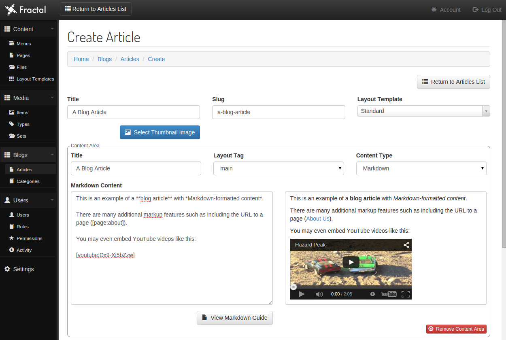

Fractal
=======

**A versatile CMS for Laravel 5.**

 

> **Note:** For Laravel 4, you may use <a href="https://github.com/Regulus343/Fractal/tree/v0.8.2">version 0.8.2</a>.

Fractal is a content management system for Laravel which maintains freedom and easy access to customization, to a range of different degrees. You can do all of this out of the box:

- Manage content pages for website
	- Create as many separate content areas as you like and create content in Markdown or an HTML WYSIWYG editor
	- Use the layout template system to re-use standardized and custom layouts across pages
	- Re-use content areas across multiple pages
- Manage files
	- Upload files
	- Resize images
	- Create thumbnail images
- Manage blog articles
	- Make use of the same versatile content area system as content pages uses
- Manage media items (images, video, audio, and more...)
- Manage website / web application settings
- Manage all menus via database, for both front-end website (optional of course) and admin/CMS area
- Manage users
- Customize routes, controllers, and subdomains (by default, "blog" and "media" subdomains are used)
- Use built-in front-end views and Blade layouts or use your own

Please keep in mind though that there are a variety of different levels of customization available from using all or a partial set of custom controllers (Fractal's controller and method routes are set in `config.php` for easy modification), using custom views, or even just customizing any of the many available config settings or database-stored settings in the CMS' Settings page. The level of control of your website or web application that you wish to externalize from Fractal is entirely up to you.

A couple more things that should be mentioned before we get started with the Table of Contents:

- Fractal uses the [Identify](https://github.com/Regulus343/Identify) authorization / authentication package and uses Twitter Bootstrap 3 as its CSS framework.
- You may view [Fractal on Trello](https://trello.com/b/ZaGw8Jly/fractal) to see what's on the bug fixing and feature implementation roadmap.

## Table of Contents

- [Installation](#installation)
- [Installation: Authentication](#auth-installation)
- [First Log In](#first-log-in)
- [Basic Usage](#basic-usage)

## Installation

**Install composer package:**

To install Fractal, make sure "regulus/fractal" has been added to Laravel 5's `composer.json` file.

	"require": {
		"regulus/fractal": "0.9.*"
	},

Then run `php composer.phar update` from the command line. Composer will install the Fractal package.

**Register service provider and set up alias:**

Now, all you have to do is register the service provider, set up Fractal's alias in `config/app.php`, publish the assets, and run the install command. Add this to the `providers` array:

	'Regulus\Fractal\FractalServiceProvider',

And add this to the `aliases` array:

	'Fractal' => 'Regulus\Fractal\Facade',

**Add and run the install command:**

Add the following to the `commands` array in `app/Console/Kernel.php`:

	'Regulus\Identify\Commands\Install',
	'Regulus\Identify\Commands\CreateUser',
	'Regulus\Fractal\Commands\Install',

Then run the following command:

	php artisan fractal:install

Fractal (along with Identify) will now be installed. This includes all necessary DB migrations, DB seeding, config publishing, and asset publishing.

The config file that is published for Identify is `auth.php` and will overwrite Laravel 5's default auth configuration. The default table names are prefixed with `auth_`, but you may alter the users table name (from which the other table names are derived) by adding a `--userstable` option to the install line:

	php artisan fractal:install --userstable=users

	php artisan fractal:install --userstable=identify_users

The former example will remove the prefix from all of the table names, so you will get `users`, `roles`, etc. The latter example will change the default table prefix of `auth_` to `identify_` so your table names will be `identify_users`, `identify_roles`, etc.

You should now have 4 users, `Admin`, `TestUser`, `TestUser2`, and `TestUser3`. All of the default passwords are simply `password` and the usernames are case insensitive, so you may simply type `admin` and `password` to log in. The 3 initial roles are `Administrator`, `Moderator`, and `Member`. `Admin` has the `Administrator` role, `TestUser` has the `Moderator` role, and the final 2 users have the `Member` role.

The install command will also attempt to automatically add a singleton to `bootstrap/app.php` which swaps out Laravel's default `LoadConfiguration` class to allow delaying the loading of certain config files until after Fractal's service provider runs. If the install command is not able to add the singleton, go into `bootstrap/app.php` and add this after the other singletons under the "Bind Important Interfaces" heading:

	$app->singleton(
		'Illuminate\Foundation\Bootstrap\LoadConfiguration',
		'Regulus\Fractal\Libraries\LoadConfiguration'
	);

## Installation for Authentication

**Install Composer package:**

To install Identify, make sure "regulus/identify" has been added to Laravel 5's `composer.json` file.

	"require": {
		"regulus/identify": "dev-master"
	},

Then run `php composer.phar update` from the command line. Composer will install the Identify package.

**Register service provider and set up alias:**

Add this to the `providers` array in `config/app.php`:

	'Regulus\Identify\IdentifyServiceProvider',

## First Log In

**Logging in:**

To log in, go to `website.com/admin` where "website.com" is the name of the site you have installed Fractal on. Type "Admin" and "password" as your username and password and click "Log In".

You should now be logged in to Fractal for the first time. You should now be able to manage the CMS and the settings of the website or web application.

**Enabling Developer Mode:**

To set a `developer` session variable to `true`, go to `website.com/admin/developer`. This will identify you as the web developer for Fractal and you may be able to see more information and manage extra settings. To turn off Developer Mode, go to `website.com/admin/developer/off`.

## Basic Usage

**Adjusting Fractal's base URI:**

By default, Fractal's base URI is `admin` making your URLs like `website.com/admin/pages/home/edit`. You may adjust this in the `base_uri` variable in `config.php`.

**Adding additional controllers:**

You may add additional controllers or point existing defined controllers to alternates in the `controllers` array in `config.php`. Use `standard` for standard Laravel controllers and `resource` for resource controllers.

**Other configuration options:**

Look around in the various config files such as `config`, `blogs`, `media`, `tables`, and `social` to see what other configuration options can easily be customized as well. Most config variables have detailed descriptions that should help you to understand how different things can be customized. The config files `menus` and `settings`, however, are exported from the database automatically to minimize a Fractal-driven website's need to make certain database queries on each page load.

**Get Bootstrap-ready menu markup for a view:**

	echo Fractal::getMenuMarkup(); //get "Main" menu markup

	echo Fractal::getMenuMarkup('Footer'); //get "Footer" menu markup

	echo Fractal::getMenuMarkup('Footer', ['class' => 'nav nav-pills']); //set class attribute for menu

**Getting an array of menu items:**

	$menu = Fractal::getMenuArray(); //get "Main" menu array

	$menu = Fractal::getMenuArray('Footer'); //get "Footer" menu array

**Setting a page title:**

Fractal already uses [SolidSite](https://github.com/Regulus343/SolidSite) to handle page titles, breadcrumb trails, and some other things which means that if you are using Fractal's public layout for your website, you may set page titles using the following code.

	//title HTML tag may look like "A Page Title :: Website.com" depending on config
	Site::set('title', 'A Page Title');

	//this can be used to differentiate the title that actually appears on the page from the primary title
	Site::set('titleHeading', 'Alternate Title in Content');

	//you may show the title using these
	echo Site::title();

	echo Site::titleHeading(); //will use "titleHeading" if it is set and if not will default to "title"